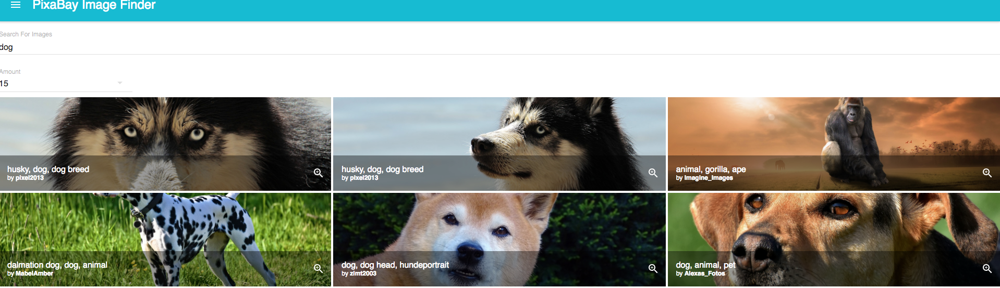

# PixaBay Image Finder

> React & Material UI app to find images utilizing the PixaBay API



Register your API Key at
[https://pixabay.com/](https://pixabay.com/)

## Quick Start

```bash
# Install dependencies
npm install

# Serve on localhost:3000
npm start

# Build for production
npm run build
```

## App Info

### Author

Bryan Wang

### Version

1.0.0

### License

This project is licensed under the MIT License